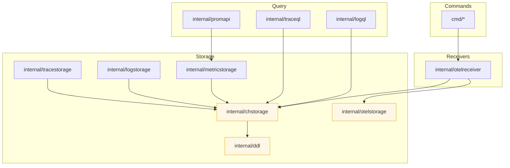

# Architecture

This document describes the actual, implemented data model and storage layout
as found in the repository (storage schemas under `internal/chstorage/_golden`).
It intentionally documents the current implementation (tables, columns,
partitioning, indexes and basic operational behaviour) rather than planned
ideas.

## Overview

- Storage engine: ClickHouse MergeTree-family tables.
- Main implemented tables (storage layer): `logs`, `traces_spans`, `metrics_points`.
- All tables have a TTL of 259200 seconds (3 days) expressed as
  `toDateTime(column) + toIntervalSecond(259200)` in schema.
- There is no explicit `tenant_id` column in the shipped schemas. Grouping
  / isolation is currently expressed via resource/service labels (see below).

## OpenTelemetry mapping

The system stores OpenTelemetry data in flattened ClickHouse tables. The
common pieces across streams are:

- `resource` / `service_namespace` / `service_name` / `service_instance_id`
  — low-cardinality strings representing the origin of the data.
- `scope`, `scope_name`, `scope_version` — instrumentation scope information.
- `attribute`, `attributes` — attributes are stored as JSON/strings or
  LowCardinality strings depending on table and use-case.
- `trace_id` / `span_id` / `trace_flags` — binary/fixed representations for
  traces.

Concrete table definitions are maintained under `internal/chstorage/_golden`.
Below are the most relevant details taken from those schemas.

## `logs` table (clickhouse)

Columns (high level):
- `service_instance_id` LowCardinality(String)
- `service_name` LowCardinality(String)
- `service_namespace` LowCardinality(String)
- `timestamp` DateTime64(9)
- `severity_number` UInt8
- `severity_text` LowCardinality(String)
- `trace_id` FixedString(16)
- `span_id` FixedString(8)
- `trace_flags` UInt8
- `body` String
- `attribute` String
- `resource` LowCardinality(String)
- `scope`, `scope_name`, `scope_version` LowCardinality(String)

Indexes:
- `idx_trace_id` — bloom_filter on `trace_id` for fast trace lookups.
- `idx_body` — `tokenbf_v1` on `body` to accelerate full-text-ish searches.
- `idx_ts` — `minmax` on `timestamp` to prune by time.
- `attribute_keys` — a `set(100)` index over JSONExtractKeys for attribute,
  scope and resource to accelerate label/attribute existence checks.

Storage settings (from schema):
- ENGINE = MergeTree
- PARTITION BY toYYYYMMDD(timestamp)  (daily partitions)
- ORDER BY (`severity_number`, `service_namespace`, `service_name`, `resource`, `timestamp`)
- PRIMARY KEY (`severity_number`, `service_namespace`, `service_name`, `resource`)
- TTL: `toDateTime(timestamp) + toIntervalSecond(259200)` (3 days)

Notes:
- Attributes are kept as JSON/string blobs in `attribute` column; extracted
  indexes use JSONExtractKeys to build a searchable set of keys.
- Labels frequently used in queries (service_ns/name/resource/severity)
  are part of ORDER BY/primary-key which makes range scans efficient.

## `traces_spans` table (clickhouse)

Columns (high level):
- `service_instance_id`, `service_name`, `service_namespace` (LowCardinality)
- `trace_id` FixedString(16), `span_id` FixedString(8)
- `trace_state` String, `parent_span_id` FixedString(8)
- `name` LowCardinality(String)
- `kind` Enum8(...)
- `start`, `end` DateTime64(9)
- `duration_ns` UInt64 MATERIALIZED toUnixTimestamp64Nano(end)-toUnixTimestamp64Nano(start)
- `status_code` UInt8, `status_message` LowCardinality(String)
- `batch_id` UUID
- `attribute`, `resource`, `scope` etc.
- arrays for events/links and their attributes

Indexes & storage:
- INDEX `idx_trace_id` — bloom_filter on `trace_id`.
- ENGINE = MergeTree
- ORDER BY (`service_namespace`, `service_name`, `resource`, `start`)
- PRIMARY KEY (`service_namespace`, `service_name`, `resource`)
- TTL: `toDateTime(start) + toIntervalSecond(259200)` (3 days)

Notes:
- The `traces_spans` schema in the repository does not declare a
  `PARTITION BY` expression (unlike `logs` and `metrics_points`).
- `duration_ns` is a materialized column derived from `start`/`end`.

## `metrics_points` table (clickhouse)

Columns (high level):
- `name` LowCardinality(String)
- `timestamp` DateTime64(9)
- `mapping` Enum8(...) — metric mapping type (e.g. histogram_count, sum)
- `value` Float64
- `flags` UInt8
- `attribute` LowCardinality(String)
- `resource` LowCardinality(String)
- `scope` LowCardinality(String)

Indexes & storage:
- INDEX `idx_ts` — minmax index on `timestamp`.
- ENGINE = MergeTree
- PARTITION BY toYYYYMMDD(timestamp) (daily partitions)
- ORDER BY (`name`, `mapping`, `resource`, `attribute`, `timestamp`)
- PRIMARY KEY (`name`, `mapping`, `resource`, `attribute`)
- TTL: `toDateTime(timestamp) + toIntervalSecond(259200)` (3 days)

Notes:
- The `mapping` enum encodes the metric point type (no-ops and histogram parts
  are distinguished here).
- The ORDER BY and primary key are chosen to speed up lookups for a metric
  time series identified by (name, mapping, resource, attribute).

## Multi-tenancy

- There is currently no dedicated `tenant_id` or `org_id` column in the
  provided table schemas. The repository schemas rely on resource/service
  labels for grouping and isolation.
- Practical ways a deployment can achieve tenant isolation with the
  current schemas:
  - Store tenant identifier as a resource or attribute (e.g. an attribute
    `tenant` or `org`) and include it in query filters. To benefit from
    ClickHouse pruning/ordering it should be added to ORDER BY/primary key
    and (optionally) the partition expression.
  - Use separate ClickHouse databases (or logical tables) per tenant.

If you plan to add native multi-tenancy support in storage (recommended for
large multi-tenant deployments), typical changes include:
- add a `tenant_id` column (UInt64/LowCardinality(String) depending on
  cardinality), include it in ORDER BY and PRIMARY KEY and in the PARTITION
  expression (if you want tenant + time partitions), or
- shard databases by tenant and keep per-tenant MergeTree tables.

## Partitioning and retention

- `logs` and `metrics_points` are partitioned by day (toYYYYMMDD(timestamp)).
  This yields daily parts that help with time-based pruning and TTL cleanup.
- `traces_spans` in the current schema has no `PARTITION BY` clause — it
  relies on the MergeTree ORDER BY to optimize access patterns and still
  has a TTL for automatic cleanup.
- TTL for all three tables is set to 259200 seconds (3 days) in the
  published schema files.

## Indexing & query notes

- Trace lookups are accelerated with a bloom filter index on `trace_id`.
- Log body search uses a tokenbf (token bloom) index for efficient
  substring/token searches; additionally there are specialized indexes built
  from JSON attribute keys to speed up label/attribute queries.
- Ordering and primary keys are chosen to group records by service/namespace
  and resource which maps well to typical queries (per-service time series
  or logs) and to Grafana-style label selections.

## Where to look in the code

- Canonical table definitions: `internal/chstorage/_golden/*.sql`
  (for logs, traces and metrics schemas seen above).
- DDL generation helpers: `internal/ddl`.
- Storage/backing code is implemented under `internal/chstorage` and
  higher-level ingestion/translation pieces live under `internal/otelreceiver`
  and related packages.

---

If you'd like, I can:
- add an explicit example showing how to enable tenant-aware partitioning
  (DDL example + migration notes), or
- open a follow-up PR that adds a `tenant_id` to all schemas and updates
  ingestion/translation to populate it (I can draft the DDL and code
  locations that need changes).

## Developer onboarding — code layout & packages

This section maps repository packages, their responsibilities and how they
depend on each other. It's written to help a new contributor find where to
look for ingestion, storage, query and DDL code.

High-level architecture

- cmd/* — executable entry points. Each subdirectory under `cmd/` contains a
  small main program that wires components and starts servers or CLIs
  (for example `cmd/oteldb` is the main oteldb binary; `cmd/otelproxy` and
  `cmd/otelbench` are tooling and helpers).
- internal/* — core library packages (not intended for external Go imports).
  This is where the bulk of ingestion, storage integration, query, and DDL
  generation lives.
- internal/chstorage — ClickHouse-backed storage layer: schema definitions,
  DDL helpers, inserters, queriers and ClickHouse client wiring.
- internal/otelreceiver — receiver/integration layer for OpenTelemetry
  ingestion (OTLP, Prometheus remote_write helpers, exporter wiring).
- internal/otelstorage — OTLP-aware helpers and compact identifiers used
  across ingestion and storage (IDs, hashing, timestamps, attribute helpers).
- internal/logstorage, internal/tracestorage, internal/metricstorage —
  higher-level logical storage abstractions for logs, traces and metrics
  (they use chstorage for ClickHouse-specific implementation details).
- internal/logql, internal/traceql, internal/promapi — query/front-end
  translator packages that implement LogQL/TraceQL/PromQL-compatible
  interfaces and translate queries into storage operations.
- internal/ddl — a small DDL generator abstraction (types for Table/Column/
  Index and the Generate function used to render ClickHouse SQL).

Package map and dependencies (simplified)

- cmd/oteldb
  -> uses internal/otelreceiver to accept telemetry
  -> uses internal/chstorage or storage abstractions to persist data
  -> wires prom/log/trace query servers (internal/promapi, internal/logql,
     internal/traceql)

- internal/otelreceiver
  -> translates OTLP/Prometheus remote write to internal representation
  -> depends on internal/otelstorage (attributes, ids) and on
     internal/chstorage inserters to write data

- internal/otelstorage
  -> helper utilities: id generation (id.go), hashing (hash.go), timestamps
  -> used by receivers and storage layers

- internal/chstorage
  -> authoritative ClickHouse mappings and SQL generation
  -> implements inserters (inserter*.go) and queriers (querier*.go)
  -> depends on internal/ddl for DDL generation and on the ClickHouse
     client (ch-go via go.mod) for transport

- internal/{log,trace,metric}storage
  -> domain-specific helpers that implement business logic on top of
     chstorage APIs (for example, series identification, exemplars,
     histogram handling)

- internal/logql / internal/traceql / internal/promapi
  -> implement query parsing and translation to storage queries
  -> depend on querier implementations in internal/chstorage

- other helpers:
  - internal/ddl: DDL types and Generate(t Table) used to render DDL SQL.
  - internal/iterators, lexerql: parsing helpers used by query translators.
  - internal/chembed / autozpages / other utility packages: auxiliary tooling.

Key abstractions and core entities

- DDL-centric types (internal/ddl):
  - Column, Table, Index, TTL — a small in-repo representation of a
    ClickHouse table that `Generate` renders into DDL SQL. Use this when
    changing schema/golden files.

- chstorage components:
  - Inserter(s): code that assembles ClickHouse INSERTs and writes batches
    (files: inserter.go, inserter_logs.go, inserter_metrics.go,
    inserter_traces.go). If you add a new column, update inserters.
  - Querier(s): code that converts higher-level query requests into
    ClickHouse SELECTs and scans results (querier*.go, querier_logs_query.go).
  - Schema files: canonical SQL ships under `internal/chstorage/_golden`.
    Those are the source-of-truth used by tests and by `internal/ddl`.
  - columns_*.go: central lists of columns and mappings used when building
    DDL and when marshalling/unmarshalling rows.

- OTLP and record mapping:
  - internal/otelreceiver / oteldbexporter / prometheusremotewrite: take
    OTLP or Prometheus inputs, extract resource attributes, instrumentation
    scope and points/spans/logs, then create objects that inserters write.
  - internal/otelstorage: ID helpers and attribute normalization — a good
    place to look when modifying how resources or attributes are encoded.

- Query languages and translation:
  - internal/logql implements the LogQL parser/translator and relies on
    chstorage queriers for execution.
  - internal/traceql implements TraceQL parsing and translation.
  - internal/promapi, promproxy and promhandler implement Prometheus
    compatible APIs and use internal/metricstorage / chstorage queriers.

Where to start as a new contributor

1. Run tests related to the area you want to change. There are many unit
   and golden tests under the `internal/*` packages. Running package tests
   quickly focuses work on a single piece.

2. For schema changes:
   - Edit the appropriate `_golden/*.sql` file under `internal/chstorage`.
   - Update `internal/chstorage/columns_*.go` and inserter/querier code
     that read/write the column.
   - Use `internal/ddl.Generate` if you need programmatic DDL generation.

3. For ingestion changes (OTLP / Prometheus):
   - Inspect `internal/otelreceiver` to find the relevant receiver.
   - Update translation code there to populate fields consumed by inserters
     (attributes, resource, trace ids, etc.).

4. For query changes:
   - Start in `internal/logql` / `internal/traceql` / `internal/promapi` to
     change parser/translator behavior.
   - Update `internal/chstorage/querier_*.go` to support new operations or
     to optimize SQL generation.

Common tasks and where to edit

- Add a new column → `_golden` SQL, columns_*.go, inserter_*.go, querier_*.go
- Add a new index → `_golden` SQL + schema.go if programmatic DDL is used
- Add a new receiver protocol → `internal/otelreceiver` and/or
  `cmd/*` wiring
- Add a new query feature → `internal/*ql` translator + `internal/chstorage`
  querier support

Important files to read first

- `internal/chstorage/schema.go` and `_golden/*.sql` — canonical schemas.
- `internal/chstorage/inserter.go` and `inserter_*.go` — how data is
  batched and inserted into ClickHouse.
- `internal/chstorage/querier_*.go` — how queries are translated and
  executed against ClickHouse.
- `internal/otelreceiver/receiver.go` and subpackages — ingestion entry
  points and translation from OTLP.
- `internal/ddl/ddl.go` — small but central DDL generator used across code.

Top external dependencies you should be aware of

- ClickHouse client: `github.com/ClickHouse/ch-go` — used by
  `internal/chstorage` for communication with ClickHouse.
- OpenTelemetry collector libs: `go.opentelemetry.io/collector` and
  `github.com/open-telemetry/opentelemetry-collector-contrib/*` — used for
  OTLP receiving and translation.
- Prometheus / PromQL libs: `github.com/prometheus/*` — used by Prometheus
  compatibility layers.
- Misc helpers: zap (logging), cobra (CLI), testify (tests), uuid, etc.

Quick contributor checklist

- Find the package most related to your change using the map above.
- Run focused unit tests for that package: `go test ./internal/chstorage -run TestXYZ`
- Make your changes, update `_golden` SQL and columns mapping if schema
  is affected, and update inserter/querier implementations.
- Run repo-wide tests if needed (`go test ./...`).

### Architecture diagrams

Below are two simple diagrams that visualize the main data flows and the
package dependency relationships. They are provided as Mermaid diagrams —
GitHub and several Markdown renderers support Mermaid; if your renderer
doesn't, the textual descriptions above and the file pointers still apply.

#### Ingest & Query flow

```mermaid
flowchart LR
  subgraph Ingest
    A[Telemetry sources<br/>OTLP / Prometheus RW] --> B[cmd/oteldb / receivers]
    B --> C[internal/otelreceiver]
    C --> D[internal/otelstorage<br/>normalize & ids]
    D --> E[internal/chstorage/inserter(s)]
    E --> F[(ClickHouse)]
  end

  subgraph Query
    G[Client / Grafana / Prometheus UI] --> H[cmd/oteldb API]
    H --> I[internal/logql<br/>internal/traceql<br/>internal/promapi]
    I --> J[internal/chstorage/querier(s)]
    J --> F
  end

  style F fill:#f2f2f2,stroke:#333,stroke-width:1px
```

Caption: telemetry flows from clients into receivers, which normalize and
write to ClickHouse via chstorage inserters; queries flow from UI/API into
query translators that call chstorage queriers which read from ClickHouse.

#### Package dependency graph



Caption: simplified package-level import/dependency relationships. Arrows
point from consumer to provider (e.g., `internal/otelreceiver` uses
`internal/otelstorage` and `internal/chstorage`).

