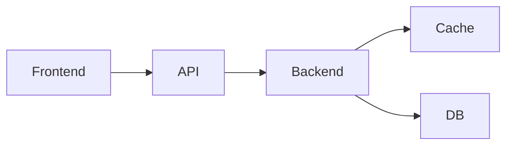
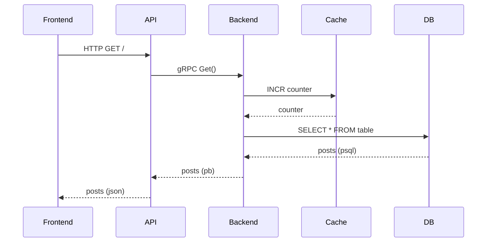

# faker

Faker models a cluster of nodes, where services are deployed, exposing an API that
is used by clients to interact with.

## Overview

## Services

### Frontend

Represents a web browser.

#### Static
- IP address
- User agent
- Target web domain

#### Dynamic
- External port

### API

Represents a web server that exposes an HTTP API.
Accepts an HTTP request, forwards it to backend via gRPC and
returns the response in json format.

#### Static
- IP address
- Server

#### Dynamic
- External port
